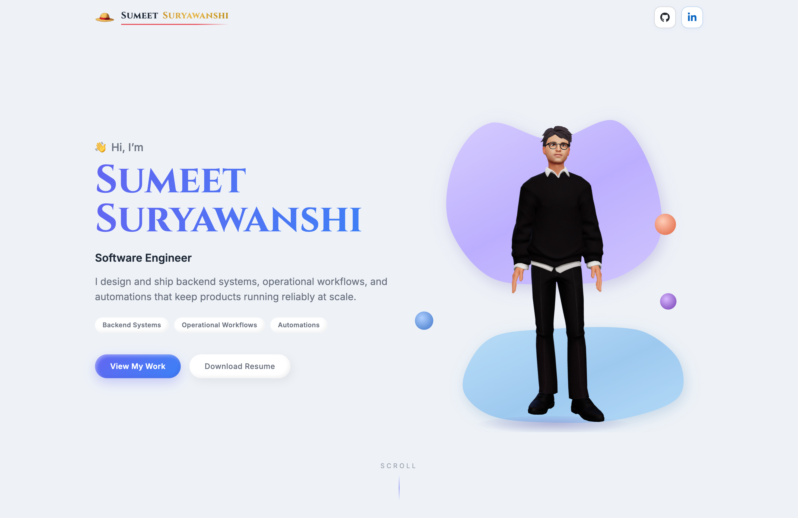
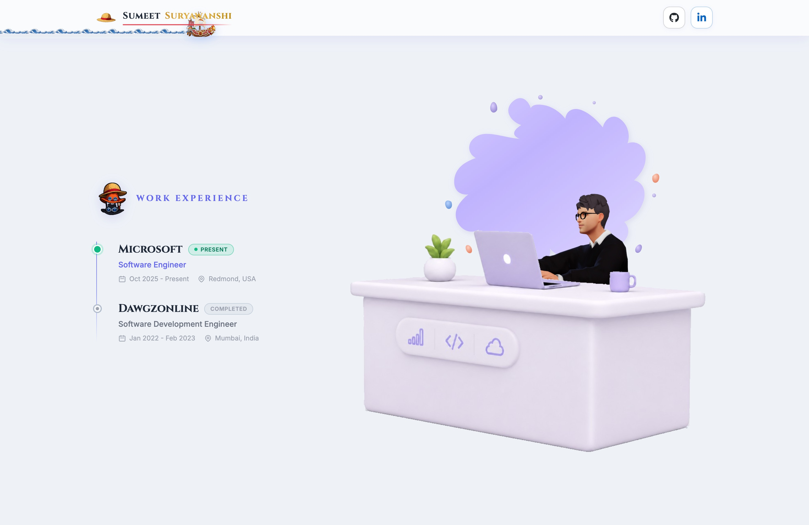
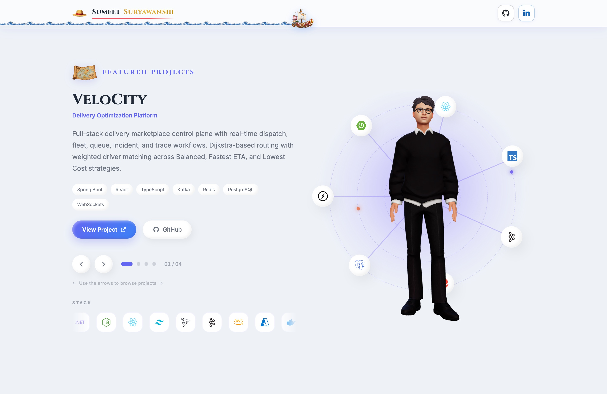
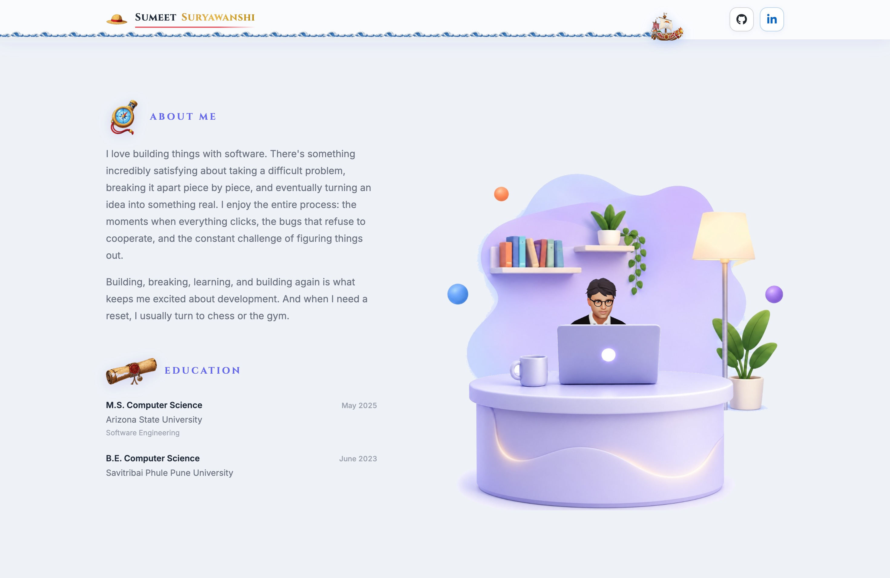
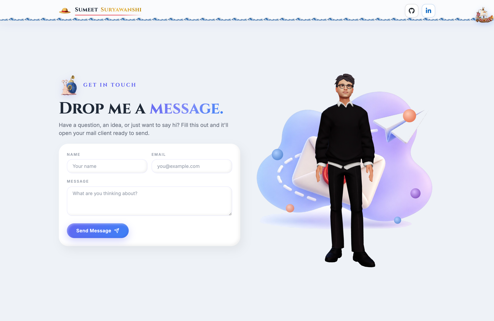

# Sumeet Suryawanshi

**Software Engineer** · Microsoft · Redmond

A scroll-driven personal portfolio where a 3D avatar walks you through experience, projects, and contact.  
Soft claymorphism UI, real Mixamo animation, and a story that moves with you.

**[Live site](https://imsumeet.github.io/Portfolio/)** · **[Resume](https://imsumeet.github.io/Portfolio/Resume.pdf)** · **[LinkedIn](https://www.linkedin.com/in/sumeetsuryawanshi/)** · **[GitHub](https://github.com/IMSUMEET)** · **[Email](mailto:s.l.suryawanshi4@gmail.com)**

---

## Scroll with me


_Hero → Experience → Projects → About → Contact_

---

## The journey

### Hero

Intro, focus areas, and a standing avatar ready to move.


### Experience

Present vs completed roles on a clean timeline, with the avatar typing at the desk.



| Role                          | Company     | Location      | Period              |
| ----------------------------- | ----------- | ------------- | ------------------- |
| Software Engineer             | Microsoft   | Redmond, USA  | Oct 2025 – Present  |
| Software Development Engineer | Dawgzonline | Mumbai, India | Jan 2022 – Feb 2023 |

### Projects

Carousel of shipped work, orbital visuals, and a live stack stream.



| Project        | Focus                                                                                 |
| -------------- | ------------------------------------------------------------------------------------- |
| **VeloCity**   | Delivery marketplace control plane with real-time dispatch and Dijkstra-based routing |
| **LeetDesign** | Interactive system-design canvas with workload simulation and bottleneck analysis     |
| **Optica**     | Algorithm visualizer for sorting, pathfinding, trees, and graphs                      |
| **Framewise**  | Serverless video recognition on AWS Lambda, S3, and ResNet-34                         |

### About

Personal side: building software for the love of the craft, plus education — with the avatar settled at the glowing desk.



| Degree                                       | School                           | Year      |
| -------------------------------------------- | -------------------------------- | --------- |
| M.S. Computer Science (Software Engineering) | Arizona State University         | May 2025  |
| B.E. Computer Science                        | Savitribai Phule Pune University | June 2023 |

### Contact

A real message form and a finale beside the mail island, with accent blobs around the avatar.



---

## What makes it different

- **One continuous 3D character** that falls, types, stands, sits, and rises as you scroll
- **Claymorphism** surfaces with indigo accents and atmospheric section art
- **Desktop choreography** with graceful fallbacks on smaller screens
- **Personal theme** woven into the craft, without getting in the way of the engineering story

---

## Built with

| Layer  | Stack                                 |
| ------ | ------------------------------------- |
| App    | React 19, Vite 6                      |
| 3D     | Three.js, React Three Fiber, Drei     |
| Motion | Framer Motion                         |
| Style  | Tailwind CSS 3, CSS custom properties |
| Icons  | react-icons                           |

Avatar model and Mixamo clips live in `src/assets/`. Pose timing lives in `src/data/heroAvatar.js`. Content lives in `src/data/resume.js`.

---

## Run locally

```bash
npm install
npm run dev
```

| Command           | What it does                                                   |
| ----------------- | -------------------------------------------------------------- |
| `npm run dev`     | Local server at [http://localhost:5173](http://localhost:5173) |
| `npm run build`   | Production build to `dist/`                                    |
| `npm run preview` | Preview the production build                                   |

---

## Project layout

```
Portfolio/
├── docs/readme/          # Screenshots + tour media for this README
├── public/
│   ├── logo.png
│   └── Resume.pdf
├── src/
│   ├── assets/           # Avatar GLB, Mixamo FBX clips, section art
│   ├── components/
│   │   ├── 3d/           # Avatar, Scene
│   │   └── sections/     # Hero, Experience, Projects, About, Contact
│   ├── data/             # Resume content + avatar pose config
│   ├── App.jsx
│   └── index.css
└── package.json
```

---

## Avatar choreography

| Transition            | Motion                                                     |
| --------------------- | ---------------------------------------------------------- |
| Hero → Experience     | Standing → Falling → Typing at the desk                    |
| Experience → Projects | Typing → Falling → Standing                                |
| Projects → About      | Standing → Falling → Sitting at the glowing desk           |
| About → Contact       | Sitting → rise → Falling → Standing beside the contact art |

---

## Links

- **Portfolio:** [https://imsumeet.github.io/Portfolio/](https://imsumeet.github.io/Portfolio/)
- **Resume:** [https://imsumeet.github.io/Portfolio/Resume.pdf](https://imsumeet.github.io/Portfolio/Resume.pdf)
- **LinkedIn:** [https://www.linkedin.com/in/sumeetsuryawanshi/](https://www.linkedin.com/in/sumeetsuryawanshi/)
- **GitHub:** [https://github.com/IMSUMEET](https://github.com/IMSUMEET)
- **Email:** [s.l.suryawanshi4@gmail.com](mailto:s.l.suryawanshi4@gmail.com)

---

Designed and built by **Sumeet Suryawanshi**.
